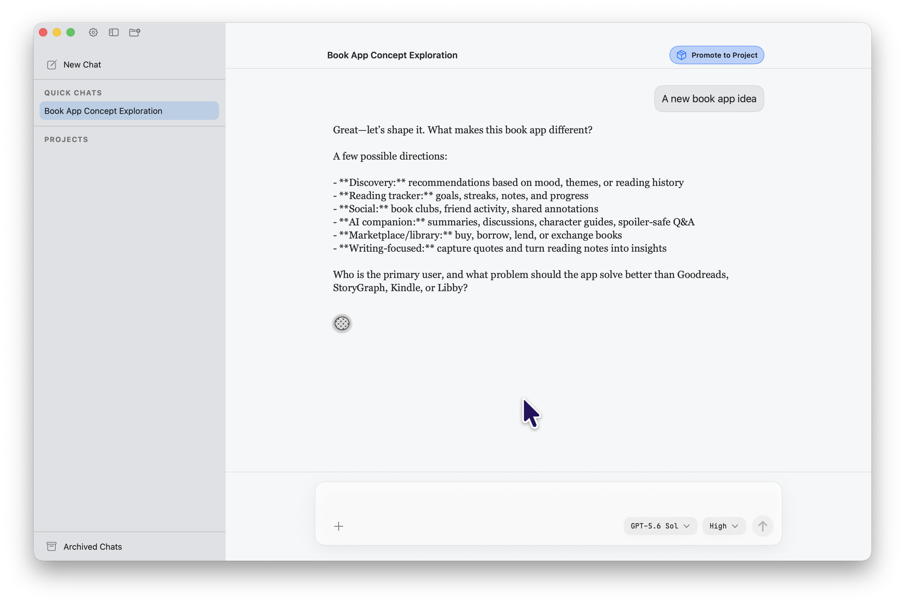

# PiNative

PiNative is a native macOS GUI for [Pi](https://pi.dev), the terminal coding-agent harness. It keeps Pi as the agent runtime and process engine, then replaces the terminal interface with a polished SwiftUI shell: project sidebar, persistent chat sessions, native transcript rendering, model selection, pending-change review, and a compose experience designed to feel at home on macOS.

This repository includes the app, its observable requirements, and implementation documentation for the current architecture.



## Philosophy

PiNative is not meant to be a thin prototype wrapper around a CLI. The product goal is a **highly polished, detail-obsessed, beautiful native macOS app for Pi**.

That means:

- Native Mac craft matters: spacing, typography, hover states, focus behavior, dividers, animation, and window chrome should feel deliberate.
- Reliability is part of polish: process lifecycle, session persistence, transcript recovery, and RPC wiring are as important as pixels.
- The shell should make Pi feel approachable without hiding its power: projects, chats, model choice, pending changes, and browser/tool surfaces should be understandable at a glance.
- Placeholder or in-progress controls should be visually honest. If a control is not functional yet, it should look disabled rather than pretending to work.

## Features

- **Native Pi conversations** — stream assistant responses, code, and grouped tool activity into a polished SwiftUI transcript while Pi remains the agent runtime.
- **Projects and Quick Chats** — organize chats under local project folders or start projectless, planning-only conversations from the Quick Chats section.
- **Parallel chat runtimes** — keep multiple conversations working independently, each with its own Pi process, transcript, draft, loading state, and scoped Stop control.
- **Durable sessions** — restore project/chat metadata and cached transcripts immediately across launches, then reconcile them with Pi's canonical session history.
- **Rich native composer** — send text, pasted or dropped images, and file references; choose the active model and effort level without leaving the chat.
- **Promote to Project** — turn a Quick Chat into a guarded project folder with generated context and provenance, then continue in a new project-scoped handoff chat.
- **Fast native navigation** — use project and chat rows, pinning, archiving/restoration, command-number shortcuts, and responsive hover controls designed for macOS.
- **Supporting work surfaces** — review Git change summaries, browse local or remote pages, inspect installed plugins/skills, and restore archived chats from the right pane.
- **Native macOS craft** — retained pane state, tuned window chrome, deliberate typography and spacing, Maple code rendering, keyboard-aware interactions, and a custom PiNative app identity.

## How It Works

PiNative launches `pi --mode rpc` as a separate process for each active conversation. The app sends JSONL commands over stdin, receives streamed events over stdout, and turns those events into native transcript and tool-activity state. Pi continues to own providers, model authentication, the agent/tool loop, and canonical session files.

Explore the [PiNative Code Architecture Walkthrough](docs/code-architecture-walkthrough.html) for a visual, source-linked tour of the app from navigation and persistence through the complete chat-message lifecycle. To use its **open in Xcode** source links locally, run:

```sh
node scripts/serve-code-architecture-walkthrough.mjs
```

## Installation

### Requirements

- A Mac running macOS 14 or newer.
- The full **Xcode** app installed (not just Apple's smaller "Command Line Tools" package). The easiest path is to open the Mac App Store, search for "Xcode", install it, open it once, and accept any prompts to install additional components. Apple’s Xcode overview is here: <https://developer.apple.com/xcode/>
- Xcode selected as the active developer directory. If you are comfortable using Terminal, run:

  ```sh
  sudo xcode-select -s /Applications/Xcode.app/Contents/Developer
  ```

  If that asks for your password, enter your Mac login password. If it prints no output, it worked.
- **Pi installed and configured before launching PiNative.** PiNative starts Pi in RPC mode; it does not bundle Pi itself. Confirm this works in Terminal first:

  ```sh
  pi --mode rpc
  ```

  You can quit that command after confirming it starts. Your normal Pi provider/API credentials should already be configured wherever Pi expects them.

### Pi executable location

PiNative resolves a `pi` executable in this order:

1. The PATH inherited when PiNative launches.
2. Your login shell's PATH. This supports user-configured npm-compatible installs such as custom npm prefixes, pnpm, Yarn, and Bun.
3. Official installer locations:

   ```text
   ~/.local/bin/pi
   ${XDG_DATA_HOME:-~/.local/share}/pi-node/current/bin/pi
   ```

4. NVM Node version directories under `~/.nvm/versions/node`, newest version first.
5. Standard executable directories:

   ```text
   /opt/homebrew/bin:/usr/local/bin:/usr/bin:/bin:/usr/sbin:/sbin
   ```

If none of those checks resolves Pi, RPC startup makes a final `pi` attempt through `/usr/bin/env` and PiNative displays recovery guidance if it cannot start. PiNative launches the resolved `pi` command; it does not depend on a hard-coded Node executable or package `cli.js` path.

In practice, install Pi normally and confirm `pi --mode rpc` works in Terminal before launching PiNative.

### Build from the command line

```sh
xcodebuild -project PiNative.xcodeproj -scheme PiNative \
  -configuration Debug -destination 'platform=macOS' build
```

The debug app will be produced under Xcode's DerivedData, for example:

```text
~/Library/Developer/Xcode/DerivedData/PiNative-*/Build/Products/Debug/PiNative.app
```

You can then open the built app directly:

```sh
open ~/Library/Developer/Xcode/DerivedData/PiNative-*/Build/Products/Debug/PiNative.app
```

### Run from Xcode

Open `PiNative.xcodeproj`, choose the `PiNative` scheme, then press `⌘R`.

If Xcode appears to run an old build, clean DerivedData or use **Product → Clean Build Folder**. More detail is in `docs/build-and-run.md`.

### First launch

On a fresh Mac, PiNative starts with an empty project list. Use the folder-plus button in the sidebar to add a local repo/folder, then start a new chat. You can also clear the project pill in the new-chat screen to start a projectless chat.

If the app reports that Pi cannot be found, confirm that `pi` works in Terminal first. PiNative checks the common Homebrew locations (`/opt/homebrew` and `/usr/local`) and then falls back to launching `pi` through your shell `PATH`.

### Run tests and checks

For iterative development, run the unit/integration suite without UI automation:

```sh
scripts/test-unit.sh
```

Pull requests run two GitHub workflow checks:

- **CI / Requirements and unit tests** — blocking; runs RFC 2119 validation, unit/integration tests, and test-bundle builds.
- **UI Tests / Deterministic macOS UI tests** — required; launches the real app on a clean hosted Mac and drives deterministic XCUITest UI flows, but skips live-Pi/provider-dependent tests.

Before pushing app changes, agents should use the focused UI helper:

```sh
scripts/test-ui-related.sh
```

For the full requirements workflow, CI behavior, UI-suite differences, and live-Pi smoke-test notes, see [Requirements and Testing](docs/requirements-and-testing.md).

## Documentation

- [`docs/code-architecture-walkthrough.html`](docs/code-architecture-walkthrough.html) — visual, source-linked architecture tour.
- [`docs/native-shell-architecture.md`](docs/native-shell-architecture.md) — deeper shell, runtime ownership, and transcript-grouping details.
- [`docs/build-and-run.md`](docs/build-and-run.md) — build/run details and Xcode cache notes.
- [`docs/releasing.md`](docs/releasing.md) — Developer ID certificate setup, notarization secrets, and draft-release procedure.
- [`docs/requirements-and-testing.md`](docs/requirements-and-testing.md) — requirements workflow, CI gate, and test commands.
- [`docs/smoke-test.md`](docs/smoke-test.md) — real-Pi manual verification scenarios.
- [`docs/THIRD_PARTY_LICENSES.md`](docs/THIRD_PARTY_LICENSES.md) — bundled asset licenses, including Maple Font.
- [`docs/README.md`](docs/README.md) — durable documentation index.

## Status

PiNative is under active development. The core native shell, parallel chat runtimes, persistence, attachments, model controls, promotion workflow, archiving/restoration, Git summary, browser, and plugin surfaces are implemented. Current boundaries include status-only pending-change review, a user-driven single-tab browser, and cancelled rather than native interactive extension prompts. The Developer ID signed/notarized DMG pipeline is ready for its first credential-backed release run.

Project work is tracked through the active development session and explicitly requested durable planning records.

## License

MIT — see `LICENSE`.

Copyright © 2026 Unsupervised, Inc.

Bundled third-party assets retain their own licenses; see `docs/THIRD_PARTY_LICENSES.md` for details.
